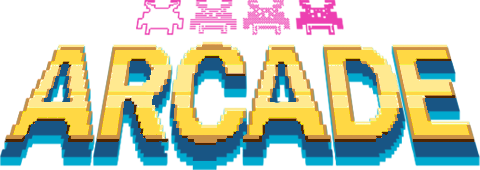

# Retromania

Retromania is a set of 80's games and (modern) graphical libraries written in C++. It comes with a modular emulator, that allow you to play old games, because old games are the best.

It has a few features for now, but will keep growing with time. The evolution steps are listed on this [Trello document](https://trello.com/b/lKQjqDIp/retromania).

- Games :
	- Nibbler (Snake)
	- Pacman
- Graphic libraries :
	- [SDL2](https://www.libsdl.org/index.php)
	- [Liblapin](https://github.com/Damdoshi/LibLapin)
	- [Libcaca](http://caca.zoy.org/wiki/libcaca)
- Scores
- Configuration available for each game

## Installation

For now the installation and compilation require all these libraries installed on your system.

1. Clone
2. `$> make`
3. `$> retro-station <path-to-the-default-library-in-lib/>`

## Participation

The emulator is built in a way that lets you create and add your own games and graphical libraries. To see how it works, there's a [full documentation](doc/Retromania.md).
